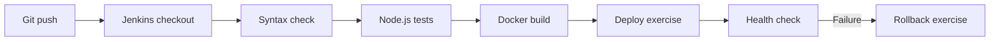

# Jenkins CI/CD & Deployment Troubleshooting Lab
[](https://github.com/praveenkoppad916-hue/jenkins-cicd-deployment-troubleshooting/actions/workflows/node-validation.yml)

[](https://github.com/praveenkoppad916-hue/jenkins-cicd-deployment-troubleshooting/actions/workflows/docker-build.yml)

A hands-on, synthetic production-support lab demonstrating
build validation, application tests, Docker packaging,
local deployment, health checks, failure diagnosis,
and rollback concepts.
## Completed CI/CD Troubleshooting Labs

This project includes four simulated CI/CD incidents covering failure investigation, root-cause analysis, corrective actions, and recovery validation.

| Lab | Failure Scenario | RCA Documentation |
|---|---|---|
| CI-001 | Deployment health-check failure | [View RCA](docs/CI-001-PIPELINE-FAILURE-RCA.md) |
| CI-002 | JavaScript build validation failure | [View RCA](docs/CI-002-BUILD-FAILURE-RCA.md) |
| CI-003 | npm dependency installation failure | [View RCA](docs/CI-003-DEPENDENCY-FAILURE-RCA.md) |
| CI-004 | Docker base-image resolution failure | [View RCA](docs/CI-004-DOCKER-BUILD-FAILURE-RCA.md) |

### Troubleshooting Methodology

1. Reproduce the simulated failure on a feature branch.
2. Examine GitHub Actions logs and identify the failing stage.
3. Investigate the root cause.
4. Apply and commit the fix.
5. Verify successful CI execution.
6. Document the root-cause analysis (RCA).
7. Merge the validated changes through a pull request.


> **Scope:** This is an independent learning project. All scenarios and logs are fictional and do not contain employer data. The initial Jenkins pipeline validates and packages the app; deployment and rollback are documented as follow-on exercises.

## Architecture



## Quick start (without Jenkins)

Requirements: Node.js 20+.

```bash
npm test
npm start
```

In another terminal:

```bash
curl -f http://localhost:3000/health
```

Expected: `{"status":"ok","service":"support-demo"}`.

## Run with Docker

```bash
docker build -t support-demo:local .
docker run --rm -p 3000:3000 support-demo:local
curl -f http://localhost:3000/health
```

## Jenkins pipeline

`Jenkinsfile` defines checkout, validation, tests, and Docker build. Run it on a trusted Jenkins agent with Node.js 20+ and Docker installed and permission to use Docker. This demo does **not** push images, use credentials, or deploy to a real environment.

## Troubleshooting playbooks

See [docs/TROUBLESHOOTING.md](docs/TROUBLESHOOTING.md) for sample incidents and investigation commands. See [docs/LEARNING_PATH.md](docs/LEARNING_PATH.md) for an incremental learning plan.

## Portfolio talking points

- Diagnosing the stage where a pipeline failed
- Reading console logs and separating build vs runtime failures
- Using tests and health checks as release gates
- Understanding safe rollback and why production deployments require approvals

## Security notes

Never commit secrets, tokens, customer data, or internal logs. Do not connect this demonstration to employer infrastructure. Run Docker and Jenkins only on a machine you control.

## License

MIT
