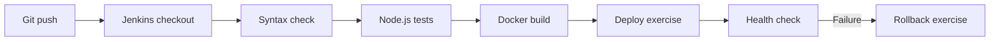

# Jenkins CI/CD & Deployment Troubleshooting Lab

A hands-on, synthetic production-support lab demonstrating build validation, application tests, Docker packaging, local deployment, health checks, failure diagnosis, and rollback concepts.

> **Scope:** This is an independent learning project. All scenarios and logs are fictional and do not contain employer data. The initial Jenkins pipeline validates and packages the app; deployment and rollback are documented as follow-on exercises.

## Architecture



## Quick start (without Jenkins)

Requirements: Node.js 20+.

```bash
npm test
npm start
```

In another terminal:

```bash
curl -f http://localhost:3000/health
```

Expected: `{"status":"ok","service":"support-demo"}`.

## Run with Docker

```bash
docker build -t support-demo:local .
docker run --rm -p 3000:3000 support-demo:local
curl -f http://localhost:3000/health
```

## Jenkins pipeline

`Jenkinsfile` defines checkout, validation, tests, and Docker build. Run it on a trusted Jenkins agent with Node.js 20+ and Docker installed and permission to use Docker. This demo does **not** push images, use credentials, or deploy to a real environment.

## Troubleshooting playbooks

See [docs/TROUBLESHOOTING.md](docs/TROUBLESHOOTING.md) for sample incidents and investigation commands. See [docs/LEARNING_PATH.md](docs/LEARNING_PATH.md) for an incremental learning plan.

## Portfolio talking points

- Diagnosing the stage where a pipeline failed
- Reading console logs and separating build vs runtime failures
- Using tests and health checks as release gates
- Understanding safe rollback and why production deployments require approvals

## Security notes

Never commit secrets, tokens, customer data, or internal logs. Do not connect this demonstration to employer infrastructure. Run Docker and Jenkins only on a machine you control.

## License

MIT
